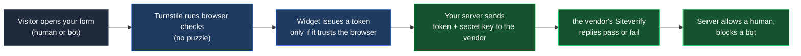
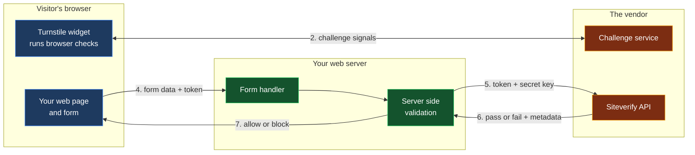
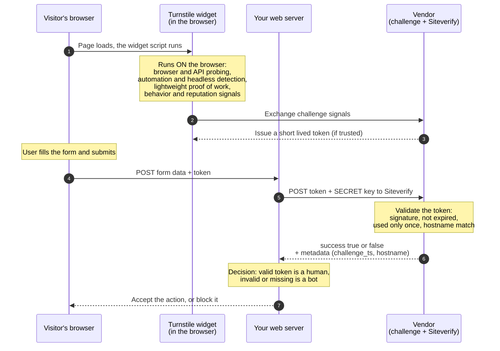

# Bots Protection demo (Turnstile)

> **Goal:** See how a modern bot check verifies a real visitor before your
> server accepts a form, with no puzzles for the user to solve.
>
> **Time:** about 15 minutes. **Level:** Beginner. **Needs:** Python 3 and an internet connection.

This is a standalone demo. It has nothing to do with the LLM exercises in this
repository. It shows Turnstile, a free service that protects forms
from bots.

---

## What you will learn

- What the bot attack on web forms looks like, and what Turnstile does about it.
- The full request flow, from the visitor's browser to your server to the vendor.
- The three Turnstile widget modes (Managed, Non-Interactive, Invisible).
- Why the browser token alone is not enough, and the server must verify it.
- How Turnstile differs from a traditional CAPTCHA.

---

## The big idea (read this first)

Web forms are a favorite target for bots. Automated scripts hammer sign up
pages, login forms, comment boxes, and checkout flows to create fake accounts,
try stolen passwords, post spam, scrape data, or buy up inventory. A plain form
cannot tell a person from a script, so it accepts every submission.

Turnstile sits in front of the form. It runs quiet checks in the visitor's
browser, looking at signals that are hard for a bot to fake, and it issues a
short lived token only when it trusts the visitor. Your server then asks
the vendor to confirm that token before it accepts the action. A human passes
without solving anything. A bot is stopped.

---

## How the protection works (diagram)



The green steps are the real gate. **The browser token alone is not trusted.**
Your server must confirm it with the vendor, so a bot that skips the widget and
posts a fake token is still rejected. You will see exactly that in Task 4.

---

<details>
<summary><b>How Turnstile decides: bot or human</b> (click to expand)</summary>

All three modes run the **same** checks. They differ only in whether the visitor
sees a widget or is ever asked to click. The checks gather signals that are
cheap for one real browser to produce but hard for a bot to fake at scale, then
score them to decide whether to issue a token.

- **Browser integrity.** Turnstile probes many browser and device APIs
  (`navigator`, `window`, rendering behavior) to confirm a real, consistent
  browser and to spot automation tools like Selenium or Puppeteer, or a headless
  browser with missing or inconsistent features.
- **Lightweight proof of work.** Tiny background computations that are trivial
  for one visitor but expensive for a bot trying to pass millions of times. They
  are invisible, with no puzzle to solve.
- **Reputation and threat intelligence.** The vendor weighs what it already
  knows about the visitor's IP address, network, and prior challenge history
  across its global network.
- **Connection and timing signals.** Low level details of the network connection
  and the timing of the checks differ between a real browser and a script.
- **Optional behavior signals.** It may consider gestures such as mouse
  movement, but it never requires the user to solve anything.
- **Adaptive decision.** If the signals look clearly human, the visitor passes
  silently. If something looks risky, Managed mode can ask for a single checkbox
  before issuing the token.

The widget combines these signals into a single decision: issue a token, or
refuse. The mode only changes what the visitor experiences, not how the bot
detection works.

</details>

---

<details>
<summary><b>Architecture at a glance</b> (click to expand)</summary>

Three parts work together: the visitor's browser running the widget, your web
server, and the vendor's services (a challenge service and the Siteverify API).
There are three separate decisions, made in three different places. The numbers
below match the steps after the diagram.



### The steps, with the exact decision at each one

1. **Page loads (browser).** Your page includes the Turnstile widget. The widget
   script downloads and runs inside the visitor's browser.
2. **Browser challenge (browser and vendor challenge service).** The widget runs
   its checks and exchanges signals with the vendor's challenge service.
   **Decision A is made here, by the widget: is this visitor trustworthy enough
   to receive a token?** A human passes silently or with one checkbox. A bot
   fails and no token is issued.
3. **Token issued (browser).** If the visitor is trusted, the widget places a
   short lived token into a hidden form field named `cf-turnstile-response`. Per
   the vendor's docs the token is at most 2048 characters, is valid for 300
   seconds (5 minutes), and can be used only once.
4. **Form submit (browser to your server).** When the visitor submits the form,
   the browser sends the form data plus that token to your server.
5. **Your server calls Siteverify (your server to the vendor).** Your server
   sends a POST to `https://challenges.cloudflare.com/turnstile/v0/siteverify`
   with two required values, your **secret key** and the **token**. The visitor
   IP is optional. The secret key never leaves your server.
6. **The vendor validates the token (the vendor).** **Decision B is made here, by
   Siteverify: is this a real, fresh, unused token for my site?** Important: it
   checks the TOKEN, not the visitor. The human or bot judgment already happened
   in step 2 when the widget decided whether to issue a token. Siteverify only
   confirms that the token is authentic (really issued by Turnstile), was issued
   against your secret key, has not expired, and has not been used before. It
   does not run the browser checks again. It returns JSON with `success` true or
   false, plus the fields described below. A reused or expired token comes back
   as `success: false` with the error code `timeout-or-duplicate`.
7. **Your server decides (your server).** **Decision C is made here, by your
   server: allow or block the action.** If `success` is true you treat the
   visitor as verified and process the form. If it is false you reject the
   request. You may also compare the returned `hostname` to your own domain for
   extra safety.

### What the Siteverify response contains

These are the fields from the vendor's documented response. Your server reads
`success` to decide, and can use the rest for extra checks.

| Field | What it means |
|-------|---------------|
| `success` | True only if the token is genuine and still valid. This is the field your server acts on. |
| `challenge_ts` | ISO 8601 time the challenge was solved, so you can tell how old the token is. |
| `hostname` | The site where the challenge was served, so you can confirm it matches your own domain. |
| `action`, `cdata` | Optional labels you set on the widget, echoed back so you can confirm the token was for the expected action. |
| `error-codes` | Why it failed, for example `invalid-input-response` (token invalid or expired) or `timeout-or-duplicate` (token already used). |

### Who decides what

| Decision | Where it happens | The question it answers |
|----------|------------------|-------------------------|
| **A. Issue a token?** | The widget, in the browser | Does this visitor look like a real, low risk human? |
| **B. Is the token valid?** | Siteverify, on the vendor | Is this token genuine, for this site, unexpired, and unused? |
| **C. Allow or block?** | Your own server | Given the validation result, do I accept this action? |

> **Why your server must do steps 5 to 7.** The vendor states plainly that the
> client side widget alone does not protect your form. Tokens can be forged (an
> attacker can post any string), tokens expire after 5 minutes, and tokens are
> single use. Only the server side check confirms the token is real, which is
> why a forged token is rejected in Task 4.

</details>

<details>
<summary><b>Full request flow (sequence diagram)</b> (click to expand)</summary>

This is the complete journey, from the checks that run inside the browser to the
final allow or block decision on your server.



</details>

<details>
<summary><b>What the vendor does on its end (and what it never sees)</b> (click to expand)</summary>

Two things happen on the vendor's side, in two phases.

**Phase 1, while the widget runs (the challenge service).** The widget gathers
signals in the browser and exchanges them with the vendor's challenge service at
`challenges.cloudflare.com`. The vendor evaluates those signals (browser
integrity, lightweight proof of work, and reputation from its global network)
and, if it trusts the visitor, mints a short lived, cryptographically signed
token that is tied to your sitekey. What the vendor sees in this phase is the
challenge signals and which site asked for the challenge (your sitekey and the
page hostname).

**Phase 2, when your server calls Siteverify.** The vendor receives only the
token, your secret key, and optionally the visitor IP. It checks the token's
signature to confirm it is authentic and was issued for your widget, confirms it
has not expired, and confirms it has not been redeemed before. It returns
`success` plus the metadata fields. What the vendor sees in this phase is just
the token and your secret.

**The mental model to build:**

- The vendor is **not** reading your form data at any point. The fields your
  user typed, the page payload, your database, none of that is sent to the
  vendor.
- During the challenge it looks at the **visitor's browser signals**, not your
  page content.
- During validation it looks **only at the token**, plus your secret key to
  authenticate the request and identify which widget the token belongs to.
- The token is best understood as an opaque, signed **receipt** that says "the
  vendor checked this visitor, at this time, for this site." Your server trusts
  that receipt only after Siteverify confirms it is genuine.

So when you ask "are they just looking at the token", the answer is: during
validation, yes, only the token (and your secret). During the challenge, they
look at browser signals to decide whether to issue that token. Your form's
contents stay on your side the whole time.

</details>

<details>
<summary><b>Protecting a mobile app</b> (click to expand)</summary>

What you do depends on whether it is mobile web or a native app.

- **Mobile web (a website opened in a phone browser).** It works exactly the
  same, with no extra steps. The widget runs in the mobile browser, issues a
  token, and your server validates it as usual.
- **Native mobile app (iOS, Android, React Native, Flutter).** Turnstile does
  not run natively, because it needs a browser to run its JavaScript challenges.
  The vendor's supported approach is a **WebView**, a browser component embedded
  in your app, that loads a page containing the widget. The token from that page
  is then sent to your server and validated with Siteverify, exactly as before.

**Requirements for the WebView**, from the vendor's documentation:

- JavaScript execution must be enabled, and the DOM storage API must be
  available.
- The app must allow network access to `challenges.cloudflare.com`.
- The User Agent must stay **consistent** for the whole session. Changing it
  mid session makes the vendor treat the visitor as suspicious and the challenge
  fails.
- A strict Content Security Policy must still allow `challenges.cloudflare.com`.

**Your server side does not change.** Whether the token came from a desktop
browser, a mobile browser, or a WebView inside a native app, your backend still
calls Siteverify with the token and your secret key, and makes the same allow or
block decision.

</details>

---

## Before you begin

You need two things.

### Step 1: Confirm Python

```bash
python3 --version
```

You should see Python 3.x. No extra packages are needed.

### Step 2: Confirm internet access

This demo loads the Turnstile widget from the vendor and verifies tokens against
the vendor's servers, so the machine needs internet. The offline LLM labs in
this repository do not, but this one does.

> **Note:** The demo ships with the vendor's public test keys, so you do not
> need an account with the vendor. To check against your own real widget instead, see
> "Use your own real keys" near the end.

---

## Task 1: Start the app

From this folder:

```bash
python3 server.py
```

Your browser opens to <http://localhost:8001>. Read the top two panels, **The
scenario** and **How the protection works**, then move on.

---

## Task 2: Pass as a human

The **Visitor type** switch is set to **Human**. Look at the three mode cards.

- **Managed:** you may see a single checkbox to tick. Tick it.
- **Non-Interactive:** a visible widget runs on its own, no clicking.
- **Invisible:** nothing appears at all.

**Expected result:** Each card's **Outcome** turns green and reads **VERIFIED
human**. Under it you see the real response your server got back from the vendor,
including `success: true`. That is the full round trip working.

---

## Task 3: Get blocked as a bot

Flip the **Visitor type** switch to **Bot**.

**Expected result:** Each widget now fails its browser check and refuses to
issue a token. Every card's Outcome turns red and reads **BLOCKED at the
widget**. Because no token was issued, the server is never even asked. The bot
is stopped at the door.

---

## Task 4: See why the server check matters

Set the switch back to **Human**, then on any card click **"Simulate a bot that
skips the widget and posts a fake token"**.

**Expected result:** The Outcome turns red and reads **BLOCKED. The server
rejected the token.** This is the most important lesson. A real attacker will
not politely use your widget. They will try to post a made up token straight to
your server. Because your server validates every token with the vendor, the
forged token is rejected. **Never trust the browser. Always verify on the
server.**

---

## Task 5: Validate the demo yourself

```bash
python3 -m unittest -v
```

**Expected result:** All tests pass. There are two layers. Deterministic tests
check the server's logic with the network mocked, so they always run. Live tests
call the vendor's Siteverify with the documented test token, and are skipped
automatically if the network is unreachable.

---

## The three modes at a glance

| Mode | What the visitor sees | Best when |
|------|-----------------------|-----------|
| **Managed** (recommended) | Usually nothing, sometimes one checkbox. The vendor decides based on risk. | You want simple setup with adaptive protection. |
| **Non-Interactive** | A visible widget with a spinner, never a click. | You want to show that a check is running, with no friction. |
| **Invisible** | Nothing at all. | You want zero visible elements on the page. |

---

## Turnstile vs a traditional CAPTCHA

A CAPTCHA asks the **user** to prove they are human by solving a puzzle.
Turnstile asks the **browser** to prove it, so the user usually does nothing.
Turnstile is a CAPTCHA alternative, not a different kind of puzzle.

| Question | Traditional CAPTCHA | Turnstile |
|----------|---------------------|----------------------|
| Who does the work | The user solves a puzzle (traffic lights, warped text). | The browser is checked automatically. Usually nothing to solve. |
| User friction | High. Puzzles are slow and often fail the first try. | Low to none. Most visitors pass without a click. |
| Accessibility | Image and audio puzzles are hard for many users. | No puzzle to solve, and it meets WCAG 2.2 AAA. |
| Privacy | Some CAPTCHAs track users across sites for advertising. | No tracking for advertising, and no personal data sold. |

---

<details>
<summary><b>Where reCAPTCHA fits: CAPTCHA vs reCAPTCHA vs Turnstile</b> (click to expand)</summary>

Think of **CAPTCHA as the category**, and **reCAPTCHA and Turnstile as two
products inside it**.

- **CAPTCHA (early 2000s).** The original idea: a test to tell humans from bots,
  usually distorted text you type. It is the umbrella term, not a single
  product.
- **reCAPTCHA (Google).** The long dominant product in this category.
  - **v2 (December 2014).** The "I am not a robot" checkbox, with image puzzles
    (traffic lights, crosswalks) when it is unsure.
  - **v3 (October 2018).** No interaction. It runs silently and returns a score
    from 0.0 to 1.0 that you act on. It leans on Google cookies and cross site
    signals.
  - **The tradeoffs.** Friction from the image puzzles in v2, and privacy,
    because it relies on Google tracking and ties into Google's ad ecosystem.
  - Official reCAPTCHA documentation: <https://developers.google.com/recaptcha>
- **Turnstile (Cloudflare, September 2022).** The newer challenger with the same
  goal but aiming to remove both tradeoffs. Usually no puzzle, and privacy
  preserving. The vendor states it never uses cookies, does not track user
  behavior, and does not rely on browsing history. It offers a similar API, so
  teams can migrate from reCAPTCHA.

**Where reCAPTCHA stands.** It is the established, widely used option and still
very capable. Its cost is user friction (the v2 puzzles) and privacy (Google
tracking). Turnstile keeps the protection while dropping the puzzle and the
tracking. CAPTCHA is the concept that both belong to.

| | CAPTCHA (concept) | reCAPTCHA v2 | reCAPTCHA v3 | Turnstile |
|--|--|--|--|--|
| Launched | early 2000s | December 2014 | October 2018 | September 2022 |
| What the user does | Solve a puzzle | Click a checkbox, sometimes solve images | Nothing | Usually nothing |
| Privacy | Varies | Google tracking and cookies | More tracking and profiling | No cookies, no behavior tracking |
| Tied to | No single owner | Google account, cookies, IP | Google, wider profiling | Not tied to identity |

</details>

---

## Use your own real keys (optional)

The demo uses test keys by default. To verify against a real widget you created
in the vendor's dashboard:

1. Create a free account with the vendor and a Turnstile widget. You receive a
   **sitekey** (public) and a **secret key** (private).
2. Put your sitekey into the matching card in `index.html` (replace the test
   sitekey in the `KEYS` map), and have the page send `real: true`.
3. Provide the secret key to the server through an environment variable, so it
   is never written into a file:
   ```bash
   TURNSTILE_SECRET=your-real-secret-key python3 server.py
   ```

The secret key is a credential. Keep it out of source control.

---

## Glossary (every term, explained)

- **Bot.** An automated script that uses a website the way a program would,
  often at high speed and large scale, rather than a real person.
- **CAPTCHA.** A test that tries to tell humans from bots, traditionally by
  asking the user to solve a puzzle. Stands for Completely Automated Public
  Turing test to tell Computers and Humans Apart.
- **Turnstile.** a free CAPTCHA alternative from the vendor that checks the browser
  instead of asking the user to solve a puzzle.
- **Widget.** The Turnstile element on your page. It runs the browser checks and
  produces a token.
- **Sitekey.** The public key that identifies your widget. It goes in your HTML
  and is safe to share.
- **Secret key.** The private key your server uses to verify a token. It is a
  credential and must be kept secret.
- **Token.** A short lived string the widget produces when it trusts the
  visitor. Your server sends it to the vendor to confirm.
- **Siteverify.** the vendor's server side endpoint that takes a token and a
  secret key and replies whether the token is valid.
- **WCAG 2.2 AAA.** The highest level of the Web Content Accessibility
  Guidelines, a standard for making web content usable by people with
  disabilities.
- **Server side validation.** Checking the token on your own server, not just in
  the browser. This is the step that actually stops forged tokens.

---

## Files in this demo

| File | Purpose |
|------|---------|
| `index.html` | The single page with the scenario, diagram, three mode cards, and the CAPTCHA comparison. |
| `server.py` | Serves the page and runs server side validation through the vendor's Siteverify. |
| `test_server.py` | Deterministic and live tests for the server. |

---

## Cleanup

Stop the server with `Ctrl+C`. The demo writes no files and creates no account.

---

## Documentation and disclaimer

Official Turnstile documentation: <https://developers.cloudflare.com/turnstile/>

Turnstile is a product of Cloudflare. This page and folder are an independent,
educational demonstration only. They are not affiliated with, sponsored by, or
endorsed by the vendor. All product names and trademarks belong to their
respective owners. Use this material for demonstration and learning purposes
only.

---

*Created by **Razi Rais** · https://razibinrais.com · Licensed under the [MIT License](../LICENSE).*
